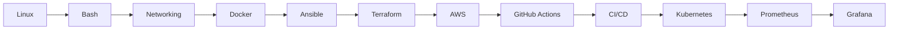

<div align="center">

# 👨‍💻 Kunin Denis


<br>


</div>

---

## Sobre mí

```bash
denis@devops:~$ whoami
Kunin Denis

denis@devops:~$ role
Cloud / DevOps / Linux Infrastructure

denis@devops:~$ location
Panamá

denis@devops:~$ interests
AWS | Automation | Linux | Networking | Containers | CI/CD
```

Soy estudiante de Ingeniería en Sistemas con interés en **Cloud Computing, DevOps, administración Linux, redes y automatización de infraestructura**.

Actualmente desarrollo proyectos prácticos utilizando **AWS, Ansible, Docker, Terraform, GitHub Actions, Linux, Bash y Python**.

---

# Tech Stack

<div align="center">

### Cloud & Infrastructure


### Containers & DevOps


### Linux


### Programming & Automation


</div>

---

# Proyectos destacados

<table>
<tr>
<td width="50%">

## Ansible Hardening Web Server

Automatización y hardening de un servidor Ubuntu desplegado en AWS.

**Stack**

`AWS EC2` `Ansible` `Ubuntu` `Nginx`

`SSH` `UFW` `Jinja2`

### Características

✔ Aprovisionamiento automatizado
✔ Hardening SSH
✔ Firewall UFW
✔ Templates Jinja2
✔ Infraestructura reproducible
✔ Idempotencia con Ansible

<a href="https://github.com/Knin90/ansible-hardening-webserver">

</a>

</td>

<td width="50%">

## CI/CD GitHub Actions

Automatización de procesos de integración y despliegue continuo.

**Stack**

`GitHub Actions` `Linux` `Git`

`Automation` `CI/CD`

### Objetivos

✔ Workflows automáticos
✔ Build automatizado
✔ Validación de cambios
✔ Integración continua
✔ Preparación para deployment

<a href="https://github.com/Knin90/ci-cd-github-actions">

</a>

</td>
</tr>

<tr>
<td width="50%">

## Red Empresarial

Simulación de infraestructura empresarial con segmentación y routing.

**Stack**

`Cisco` `VLAN` `OSPF`

`DHCP` `NAT/PAT` `ACL`

### Implementación

✔ VLAN
✔ Routing OSPF
✔ DHCP
✔ NAT/PAT
✔ ACL
✔ SSH
✔ Servidor HTTP

<a href="https://github.com/Knin90/simulacion-red-empresarial">

</a>

</td>

<td width="50%">

## Monitor de Red Linux

Herramienta de diagnóstico y monitoreo de red desde terminal.

**Stack**

`Python` `Bash` `Linux`

`Networking`

### Funcionalidades

✔ Diagnóstico de conectividad
✔ Automatización de comandos
✔ Herramientas de red
✔ Interfaz desde terminal

<a href="https://github.com/Knin90/monitor-red">

</a>

</td>
</tr>
</table>

---

# DevOps Journey

<div align="center">

```text
                     ☁️ CLOUD
                        │
                        ▼
                       AWS
                        │
                        ▼
                  INFRASTRUCTURE
                   /          \
                  /            \
           Terraform          Ansible
               │                 │
               └───────┬─────────┘
                       │
                       ▼
                     Linux
                       │
                       ▼
                     Docker
                       │
                       ▼
                  GitHub Actions
                       │
                       ▼
                      CI/CD
                       │
                       ▼
                   Kubernetes
                       │
                       ▼
             Monitoring / Security
```

</div>

---

# Actualmente trabajando en

## Docker + Ansible Roles

```text
Ansible Controller
        │
        ▼
   AWS EC2 Ubuntu
        │
        ▼
┌─────────────────────┐
│    Ansible Roles    │
├─────────────────────┤
│ common              │
│ docker              │
│ app                 │
└──────────┬──────────┘
           │
           ▼
     Docker Compose
           │
    ┌──────┼──────┐
    ▼      ▼      ▼
  Nginx   App    Redis
```

Implementando:


---

# GitHub Analytics

<div align="center">


</div>

<br>

<div align="center">


</div>

---

# Contribution Animation

<div align="center">


</div>

---

# Activity Graph

<div align="center">


</div>

---

# Roadmap



---

#  Áreas de interés

<div align="center">


</div>

---

#  Conecta conmigo

<div align="center">

<a href="https://github.com/Knin90">

</a>

</div>

---

<div align="center">

### Automate. Deploy. Secure. Improve.


</div>

